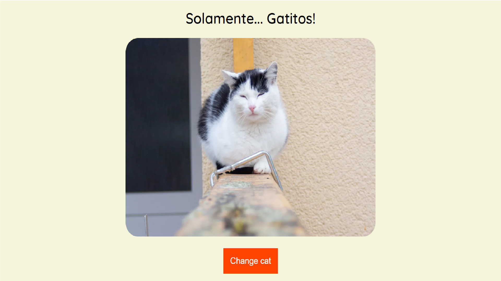

# Criando site de gatinhos 

Esse projeto tem como objetivo apresentar uma serie de fotos de gatinhos, interagindo com o usuario ao clicar no botão "change cat" para mudar de foto e ve routros gatinhos.

Foi utilizado:

- JavaScript
- HTML
- CSS
- API que direciona o banco de dados das fotos dos gatinhos. 

Embaixo uma foto, apresentação do site.

